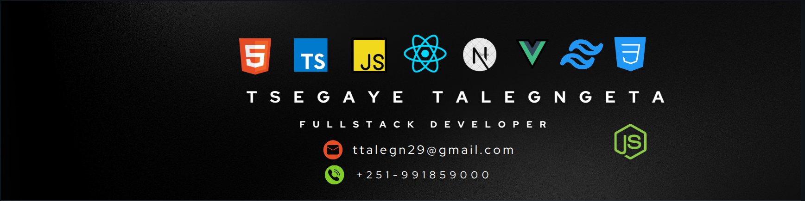

<h1 align="center">Hi 👋, I'm Tsegaye</h1>
<h3 align="center">Software Engineer and Full-stack developer</h3>

  

- 🌱 I’m currently learning **Nest and React Native**

- 💬 Ask me about **React, Express, Vue, Next, Nuxt**

- 📫 How to reach me **ttalegn29@gmail.com**
- <a href="https://tsegaye-talegngeta.vercel.app">Portfolio Site</a>

<h3 align="left">Connect with me:</h3>

<h3 align="left">Languages and Tools:</h3>

                    

 

 
 
 
 
 
 
 
 

&nbsp;

 

